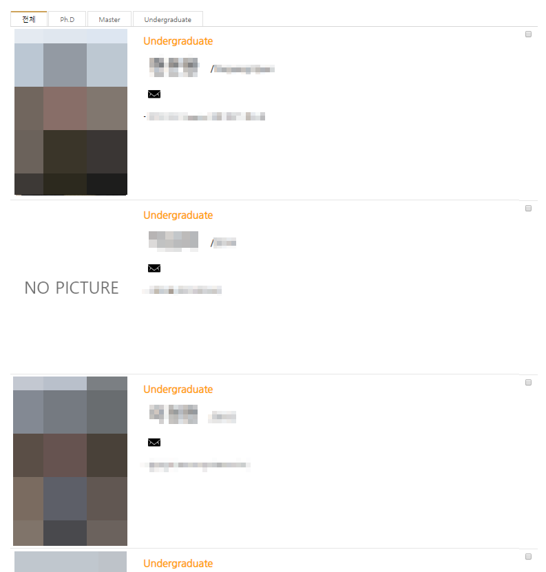

# XE-Member
Xpress Engine Default Board Skin

## Info

- XE의 [`기본 게시판`](https://www.xpressengine.com/index.php?mid=download&package_id=18325662) 스킨을 이용한 Member 스킨입니다.
- 내부에 첨부된 사진의 정보를 바탕으로 목록을 보여줍니다.
- 게시판이기 때문에 `이동 및 관리`가 쉽습니다.
- 실사용 사례는 [여기](http://infolab.kunsan.ac.kr/index.php?mid=board_qvke37)에서 확인할 수 있습니다.
- XE 작동 확인 버전 : [1.11.5](https://www.xpressengine.com/index.php?mid=download&package_id=18325662&release_id=22756181)

## How to use

1. member_skin을 다운로드합니다.
2. 기본 게시판 Skin 폴더에 압축을 해제합니다.
3. 관리자 페이지에서 skin을 변경합니다.

## Modify Content

- 1.1.0
  - 이미지가 없을 때 비어있다는 이미지 표시

- 1.0.0
  - 정식 릴리즈

- 0.0.1
  - 한글이름/영문이름/이메일/상세내용 화면에 표시
  - 한 화면에 표시 가능한 Member 수 고정

## Copyright

- 비상업적 용도로 사용 가능하며 링크를 반드시 포함해주세요.
- 문제가 되는 내용이 있다면 언제든지 [`issue`](https://github.com/Sotaneum/XE-Member/issues/new), [`Pull requests`](https://github.com/Sotaneum/XE-Member/compare) 부탁드립니다.
